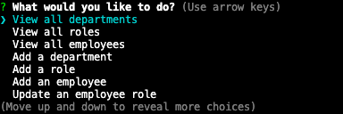
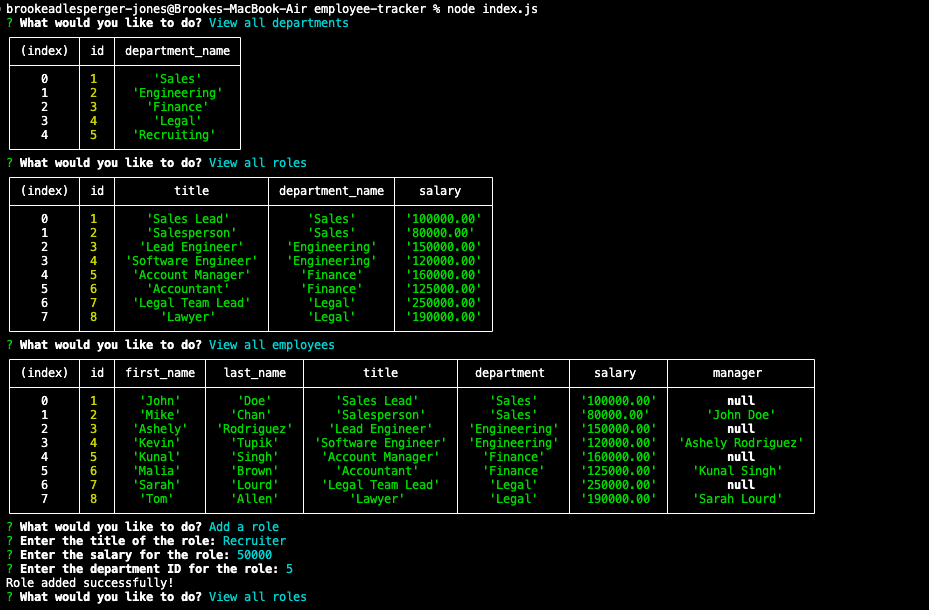

# module-twelve-challenge
Employee Tracker

## Description

The goal of this project was to create a command-line application that can manage a company's employee database. 

## Installation

N/A

## Usage

The usage of this application is to give employers an application where they can easily see and update their employee database. Using this application the user can view all departments, roles and employee information including their name, salary, position and manager's name. This information can be easily added or updated as needed by following the simple prompts. 

Please refer to the video at the following link to see a walkthrough video demonstration for this application: https://youtu.be/L5WRJq0csfs

## Credits

N/A

## License

Please refer to the license in the repo